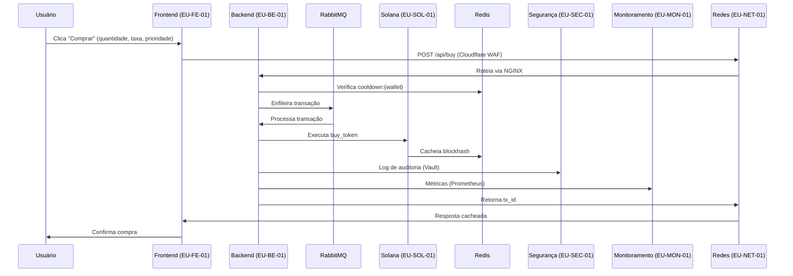
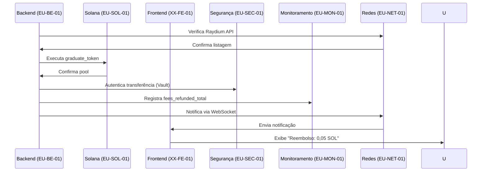

# BlitzHub Project Plan

## Visão Geral

**Objetivo**: Desenvolver a **BlitzHub**, uma plataforma descentralizada na blockchain Solana para criação, negociação e graduação de tokens, competindo com Pump.fun. Suporta ~16.000 usuários simultâneos, ~65.000 requisições por segundo (req/s), ~35.000 transações por hora (tx/hora), com latência global ~25ms. Prioriza usabilidade (3 cliques para criar token, 2 para comprar), design mobile-first (min-width: 320px), e transparência com avisos sobre taxas, riscos, limites e reembolsos. Utiliza **@solana/web3.js** (1.95.0) e **@solana/spl-token** (0.4.0) para interações rápidas e seguras.

**Desenvolvedor**: **Klytic** (equipe de uma pessoa)

- **Domínio**: `blitzhub.sol`
- **Email**: `contact@klytic.com`
- **Página**: Landing page em `klytic.com`, integrada a Discord, Telegram, Twitter
- **Missão**: Soluções blockchain rápidas, seguras e acessíveis, promovendo inovação Web3

**Repositório**: `blitzhub-ops` (GitHub), com issues (#1 a #22), playbooks Ansible, e guias

**Recursos**:

### Infraestrutura

- **Oracle Cloud Free Tier** (12 contas fixas, sem movimentação de VMs):
  - **Por Conta**:
    - 1 VM **A1.Flex**: 4 OCPUs, 24 GB RAM, 200 GB disco
    - 2 VMs **E2.1.Micro**: 1 OCPU, 1 GB RAM, 50 GB disco
    - 1 Flexible Load Balancer (10 Mbps)
    - 1 Network Load Balancer
    - 20 GB Autonomous Database
    - 20 GB Object Storage
  - **Contas e Regiões**:
    - **Frontend**:
      - EU-FE-01 (Frankfurt)
      - NA-FE-01 (Ashburn)
      - SA-FE-01 (São Paulo)
      - AF-FE-01 (Johannesburg)
      - AS-FE-01 (Singapore)
      - AU-FE-01 (Sydney)
      - ME-FE-01 (Dubai)
    - **Backend**:
      - EU-BE-01 (Frankfurt)
      - NA-BE-01 (Ashburn)
    - **Segurança**: EU-SEC-01 (Frankfurt)
    - **Redes**: EU-NET-01 (Frankfurt)
    - **Monitoramento**: EU-MON-01 (Frankfurt)
    - **Solana**:
      - EU-SOL-01 (Frankfurt)
      - AS-SOL-01 (Singapore)
    - **Gerenciamento**: EU-MGMT-01 (Frankfurt)
  - **Configuração**:
    - Ubuntu 22.04 LTS
    - SSH (chaves Ed25519, rotacionadas a cada 90 dias)
    - Ansible Tower: Playbooks (`setup_vm.yml`, `setup_db.yml`), execução <5 min/VM
    - VCN: `BlitzHubVCN`, CIDR `10.0.0.0/16`
    - Subnets:
      - EU-FE-01: `10.0.1.0/24`
      - NA-FE-01: `10.1.2.0/24`
      - SA-FE-01: `10.2.3.0/24`
      - AF-FE-01: `10.3.4.0/24`
      - AS-FE-01: `10.4.5.0/24`
      - AU-FE-01: `10.5.6.0/24`
      - ME-FE-01: `10.6.7.0/24`
      - EU-BE-01: `10.0.8.0/24`
      - NA-BE-01: `10.1.8.0/24`
      - EU-SEC-01: `10.0.9.0/24`
      - EU-NET-01: `10.0.10.0/24`
      - EU-MON-01: `10.0.11.0/24`
      - EU-SOL-01: `10.0.12.0/24`
      - AS-SOL-01: `10.4.12.0/24`
      - EU-MGMT-01: `10.0.13.0/24`
    - Security Lists:
      - Ingress: TCP 80, 443, 3000 (Fastify), 6379 (Redis), 5672 (RabbitMQ), 8899 (Solana), 8200 (Vault)
      - Egress: Tudo permitido
    - NSGs:
      - Frontend: 80, 443
      - Backend: 3000, 6379, 5672
      - Solana: 8899
      - Segurança: 8200
    - Storage:
      - Buckets: `AssetsBlitzHubEU`, `LogsBlitzHubEU`, gzip (~50% redução)
      - Backup: Rotação semanal, 30 dias
    - Banco:
      - Autonomous DB: `TokensDB`, `FeesDB`, `RewardsDB`, `ReferralsDB`, `UsersDB`
      - Configuração: Auto-scaling, 20 GB, índices B-tree (`idx_mint_wallet`, `idx_created_at`)
      - Backup: Diário, retenção 7 dias
- **Cloudflare**:
  - **CDN** (~300 PoPs):
    - Cache: Assets estáticos (JS, CSS, imagens, `max-age=604800`), APIs públicas (`Cache Everything`, TTL 10s, headers `ETag`)
    - Compressão: Brotli (~20% menos banda)
  - **DDoS**:
    - Mitigação L3/L7: Ataques volumétricos (>1M req/s) e aplicacionais
    - Modo “Under Attack”: Ativado manualmente em picos
  - **DNS**:
    - DNSSEC: Chaves rotacionadas trimestralmente
    - GeoDNS: Roteamento ao PoP mais próximo (<30ms)
    - Registros: A, AAAA, CNAME (`api.blitzhub.sol`), TXT (SPF, DKIM)
  - **WAF**:
    - Regras: `cf.threat_score > 50`, bloqueio SQLi/XSS, proteção `/admin`, `/api/buy`
    - Atualização: Semanal, via Cloudflare CLI (2.18.0)
  - **Rate Limiting**:
    - 50 req/10s: `/api/buy`, `/api/create`
    - 100 req/10s: `/api/tokens`
  - **Zero Trust**:
    - Acesso admin: 2FA, IP restrito
    - Endpoints: `/admin`, `/metrics`
  - **Analytics**:
    - Logs: Exportados para Loki (TTL 7 dias)
    - Métricas: `cf_requests_total`, `cf_threats_blocked`

### Tecnologias e Versionamento

- **Frontend**:
  - **Node.js**: 18.20.0
  - **React**: 18.3.0 (~100ms renderização)
  - **Vite**: 5.4.0 (~2s build)
  - **Tailwind CSS**: 3.4.0 (<1s estilização)
  - **Recharts**: 2.12.0 (gráficos, lotes de 100 pontos, <50ms)
  - **react-joyride**: 2.8.0 (tutorial, +20% retenção)
- **Backend**:
  - **Node.js**: 18.20.0
  - **Fastify**: 4.28.0 (~7000 req/s)
  - **RabbitMQ**: 3.12.0 (~10.000 mensagens/hora, `x-message-ttl: 10000`)
  - **Redis**: 7.2.0 (~100.000 ops/s, `maxmemory-policy allkeys-lru`)
  - **OpenTelemetry**: 0.52.0 (Jaeger 1.60.0, amostragem 10%)
- **Solana**:
  - **Solana CLI**: 1.18.0
  - **@solana/web3.js**: 1.95.0 (~10ms RPC)
  - **@solana/spl-token**: 0.4.0
  - **Rust**: 1.80.0
  - **Anchor**: 0.30.0 (~10% menos gas)
- **Segurança**:
  - **Suricata**: 7.0.0 (<200ms, OWASP rules)
  - **CrowdSec**: 1.5.0 (~50 req/s por IP)
  - **Vault**: 1.17.0 (AES-256, mTLS, `ttl=720h`)
  - **Wazuh**: 4.9.0 (~100.000 eventos/hora)
  - **Kyverno**: 1.12.0 (políticas Kubernetes)
  - **Sigstore (Cosign)**: 2.4.0 (assinatura Docker)
  - **Scorecard**: 5.0.0 (score >8)
  - **Dependabot**: Atualização semanal
  - **Trivy**: 0.55.0 (rejeita vulnerabilidades críticas)
- **Redes**:
  - **ModSecurity**: 3.0.12 (~500 req/s, OWASP)
  - **NGINX**: 1.24.0 (cache API, TTL 10s)
  - **HAProxy**: 2.10.0 (~20.000 req/s, `option redispatch`)
  - **Bind9**: 9.18.0 (<10ms, cache TTL 300s)
  - **Envoy**: 1.31.0 (~15.000 req/s, roteamento por headers)
- **Monitoramento**:
  - **K3s**: 1.30.0 (Kubernetes leve)
  - **Prometheus**: 2.54.0 (~10.000 métricas/s)
  - **Grafana**: 11.2.0 (dashboards interativos)
  - **Loki**: 3.1.0 (~1M logs/dia, gzip)
  - **Jaeger**: 1.60.0 (~1000 traces/min)
- **Gerenciamento**:
  - **Rasa**: 3.6.0 (~98% acurácia, intents `fees`, `refund_status`)
  - **ArgoCD**: 2.12.0 (Canary 10%)
  - **Telegraf**: 1.32.0 (bots sociais, 500 mensagens/hora/canal)

### Inter-relações dos Componentes

**Fluxo de Compra de Token**:

- **Frontend (XX-FE-01)**: Usuário seleciona quantidade, taxa (dropdown: 0%, 0,25%, 0,5%), prioridade (slider: verde/baixa, amarelo/média, vermelho/alta) → Chama `POST /api/buy` via Fastify.
- **Backend (EU-BE-01, NA-BE-01)**: Valida limite (Redis `cooldown:{wallet}`, TTL 10s), calcula taxas (`getFeeForMessage`), enfileira transação (RabbitMQ `queue_high`).
- **Solana (EU-SOL-01, AS-SOL-01)**: Executa `buy_token` (Rust/Anchor), atualiza mint, cacheia blockhash (Redis, TTL 5s).
- **Segurança (EU-SEC-01)**: Suricata monitora `/api/buy` contra XSS; Vault fornece chave para assinatura (mTLS).
- **Monitoramento (EU-MON-01)**: Prometheus registra `api_requests_total`, `transaction_confirmation_time`; Loki armazena logs; Jaeger traça latência.
- **Gerenciamento (EU-MGMT-01)**: Bot Telegram responde `/stats` com volume; ArgoCD atualiza serviços (Canary 10%).
- **Redes (EU-NET-01)**: NGINX faz proxy; Cloudflare cacheia resposta (TTL 10s).

**Fluxo de Graduação**:

- **Backend (EU-BE-01)**: `/api/graduate` verifica Raydium API, calcula reembolsos (`FeesDB`), paga recompensas (`RewardsDB`).
- **Solana (EU-SOL-01)**: Finaliza pool com `graduate_token`, transfere SOL via `@solana/web3.js`.
- **Frontend (XX-FE-01)**: Notifica usuário (“Reembolso: 0,05 SOL”).
- **Segurança (EU-SEC-01)**: Wazuh registra auditoria; Vault autentica transferência.
- **Monitoramento (EU-MON-01)**: Grafana exibe `fees_refunded_total`, `rewards_distributed_total`.
- **Redes (EU-NET-01)**: HAProxy roteia WebSocket para notificação.

**Dependências Críticas**:

- **Redis**: Cache de taxas, limites, blockhashes (todas as regiões).
- **RabbitMQ**: Filas assíncronas (EU-BE-01, NA-BE-01).
- **Cloudflare**: CDN (assets, `max-age=604800`), WAF (SQLi/XSS), GeoDNS (<30ms).
- **Vault**: Chaves de carteiras (EU-SEC-01).
- **Prometheus/Grafana**: SLOs (latência <50ms, uptime 99,9%, erro <0,1%).

**Diagrama de Fluxo de Compra**:



**Diagrama de Fluxo de Graduação**:



### SLOs (Service Level Objectives)

- **Latência**: <50ms (p95) para APIs, <25ms para assets
- **Uptime**: 99,9% (exclui manutenção)
- **Taxa de Erro**: <0,1% em `/api/buy`, `/api/create`
- **Throughput**: 65.000 req/s, 35.000 tx/hora
- **Usuários Simultâneos**: 16.000
- **Confirmação de Transação**: <500ms (baixa), <200ms (média), <100ms (alta)

### Documentação

- **Repositório**: `blitzhub-ops`
- **Estrutura**:
  - `/docs`: API, infraestrutura, segurança
  - `/infra`: Playbooks Ansible
  - `/tests`: Planos de teste
  - `/monitoring`: Configurações Prometheus
  - `/security`: Regras Suricata, WAF
- **Issues**: #1 a #22, rastreando progresso
- **Guias Derivados** (a criar pós-lançamento):
  - **API**: OpenAPI, exemplos `curl`
  - **Infraestrutura**: Setup VMs, VCN
  - **Smart Contracts**: Rust, testes
  - **Monitoramento**: Dashboards Grafana
  - **Segurança**: Configuração Vault, Wazuh
  - **Testes**: Unitários, carga
  - **Operação**: Failover, atualizações

**Duração**: 62 dias

## Sistema de Taxas, Prioridades e Reembolsos

### 1. Taxas por Transação

- **Taxas da Plataforma**:

  - **No Fee (0%)**: Apenas gas fee (~0,0001 SOL/tx, baixa prioridade). Usado em promoções ou volume >100 SOL.
  - **Standard (0,25%)**: 0,25% do volume (ex.: 10 SOL → 0,025 SOL).
  - **Premium (0,5%)**: 0,5% do volume (ex.: 10 SOL → 0,05 SOL).

- **Taxas da Rede (Gas Fees)**:

  - Calculadas via `connection.getFeeForMessage()`:
    - **Baixa**: ~0,0001 SOL/tx, ~500ms
    - **Média**: ~0,0005 SOL/tx, ~200ms
    - **Alta**: ~0,001 SOL/tx, ~100ms
  - Slider: “Lento → Rápido” (verde/baixa, amarelo/média, vermelho/alta)
  - Alerta: “Rede congestionada! Alta: ~0,002 SOL” (métricas Solana)

- **Soma das Taxas**:

  - Total = Plataforma + Gas
  - Exemplos:
    - No Fee + Baixa: ~0,0001 SOL
    - Standard (0,25%) para 10 SOL + Média: 0,025 SOL + 0,0005 SOL = 0,0255 SOL
    - Premium (0,5%) para 10 SOL + Alta: 0,05 SOL + 0,001 SOL = 0,051 SOL

- **Transparência**:

  - **Frontend**:

    - No Fee: “Taxa: 0% (apenas Gas ~0,0001 SOL)”
    - Standard: “Taxa: 0,25% (0,025 SOL para 10 SOL) + Gas (~0,0005 SOL)”
    - Premium: “Taxa: 0,5% (0,05 SOL para 10 SOL) + Gas (~0,001 SOL)”
    - Breakdown: “Plataforma: X SOL | Rede: Y SOL | Total: Z SOL”
    - Avisos:
      - “Investir em tokens envolve riscos.”
      - “Sem garantia de graduação na Raydium.”
      - “Limite: 50M tokens/carteira.”
      - “Cooldown: 10s entre compras.”
      - “Termos: blitzhub.sol/terms”

  - **Backend**:

    ```javascript
    async function calculateFees(amount, fee_type, priority, connection) {
      let platform_fee = 0;
      if (fee_type === "standard") platform_fee = amount * 0.0025;
      if (fee_type === "premium") platform_fee = amount * 0.005;
      const message = await createTransactionMessage(amount, priority);
      const gas_fee = await connection.getFeeForMessage(message);
      const multiplier = priority === "low" ? 1 : priority === "medium" ? 2 : 4;
      return {
        platform_fee,
        gas_fee: gas_fee * multiplier,
        total: platform_fee + (gas_fee * multiplier)
      };
    }
    ```

  - **Banco** (`FeesDB`):

    ```sql
    CREATE TABLE fees (
      fee_id VARCHAR2(36) PRIMARY KEY,
      mint VARCHAR2(44),
      wallet VARCHAR2(44),
      platform_fee NUMBER,
      gas_fee NUMBER,
      fee_type VARCHAR2(10) CHECK (fee_type IN ('no_fee', 'standard', 'premium')),
      priority VARCHAR2(10) CHECK (priority IN ('low', 'medium', 'high')),
      created_at TIMESTAMP DEFAULT CURRENT_TIMESTAMP,
      status VARCHAR2(20) DEFAULT 'pending' CHECK (status IN ('pending', 'refunded')),
      FOREIGN KEY (mint) REFERENCES tokens(mint)
    );
    CREATE INDEX idx_mint_wallet ON fees(mint, wallet);
    CREATE INDEX idx_created_at ON fees(created_at);
    ```

  - **Monitoramento**:

    - Prometheus: `platform_fees_collected_total`, `gas_fees_collected_total`
    - Grafana: Dashboard “Taxas por Tipo/Prioridade”
    - Alertas: `platform_fees_collected_total > 1000`

### 2. Prioridades

- **Baixa**: ~0,0001 SOL/tx, ~500ms, custo mínimo.

- **Média**: ~0,0005 SOL/tx, ~200ms, equilíbrio.

- **Alta**: ~0,001 SOL/tx, ~100ms, trading rápido.

- **Relação com Taxas**:

  - No Fee: Apenas gas.
  - Standard/Premium: Plataforma + gas.

- **Implementação**:

  - **Backend**:

    ```javascript
    const calculateGasFee = async (priority, connection, transaction) => {
      const fee = await connection.getFeeForMessage(transaction);
      const multiplier = priority === "low" ? 1 : priority === "medium" ? 2 : 4;
      return fee * multiplier;
    };
    ```

  - **Frontend**:

    - Slider com tooltip: “Baixa: ~0,5s, ~0,0001 SOL | Média: ~0,2s, ~0,0005 SOL | Alta: ~0,1s, ~0,001 SOL”
    - Feedback: Cor e texto dinâmicos

  - **Monitoramento**:

    - Prometheus: `transaction_confirmation_time{priority="low|medium|high"}`
    - Grafana: “Tempo por Prioridade”
    - Alertas: `transaction_confirmation_time > 0.5`

### 3. Reembolsos na Graduação

- **Regra**: 100% da taxa de plataforma reembolsada na graduação (Raydium). Gas não reembolsado.

- **Exemplo**:

  - Trader 1: 1 SOL, Premium (0,5%) → 0,05 SOL → Reembolso: 0,05 SOL
  - Trader 2: 0,5 SOL, Standard (0,25%) → 0,0125 SOL → Reembolso: 0,0125 SOL

- **Implementação**:

  - **Backend**:

    ```javascript
    async function processRefunds(mint, connection) {
      const refunds = await db.query(
        `SELECT wallet, SUM(platform_fee) as total_fee
         FROM fees WHERE mint = :mint AND status = 'pending'
         GROUP BY wallet`,
        { mint }
      );
      for (const { wallet, total_fee } of refunds) {
        const tx = await transferSOL(wallet, total_fee, connection);
        console.log(`Refunded ${total_fee} SOL to ${wallet}, tx: ${tx}`);
        await db.query(`UPDATE fees SET status = 'refunded' WHERE mint = :mint AND wallet = :wallet`, { mint, wallet });
      }
    }
    ```

  - **Banco**: `FeesDB` (`status: pending|refunded`)

  - **Frontend**: Notificação: “BHT1 graduado! Reembolso: 0,05 SOL”

  - **Monitoramento**:

    - Prometheus: `fees_refunded_total`, `fees_refunded_count`
    - Grafana: “Reembolsos por Token”
    - Alertas: `fees_refunded_total > 100`

### 4. Recompensas por Token Graduado

- **Padrão**: 2 SOL por token graduado.

- **Influenciador**: 10 SOL (>10.000 seguidores, lista manual).

- **Inicial**: 5 SOL (primeiros 500 tokens).

- **Implementação**:

  - **Backend**:

    ```javascript
    async function processReward(mint, wallet, type, connection) {
      const amount = type === "initial" ? 5 : type === "influencer" ? 10 : 2;
      const tx = await transferSOL(wallet, amount, connection);
      await db.query(
        `INSERT INTO rewards (reward_id, mint, wallet, amount, type, created_at)
         VALUES (:id, :mint, :wallet, :amount, :type, CURRENT_TIMESTAMP)`,
        { id: uuid(), mint, wallet, amount, type }
      );
      return tx;
    }
    ```

  - **Banco** (`RewardsDB`):

    ```sql
    CREATE TABLE rewards (
      reward_id VARCHAR2(36) PRIMARY KEY,
      mint VARCHAR2(44),
      wallet VARCHAR2(44),
      amount NUMBER,
      type VARCHAR2(20) CHECK (type IN ('standard', 'influencer', 'initial')),
      created_at TIMESTAMP DEFAULT CURRENT_TIMESTAMP,
      FOREIGN KEY (mint) REFERENCES tokens(mint)
    );
    CREATE INDEX idx_mint_wallet ON rewards(mint, wallet);
    ```

  - **Frontend**: Dashboard: “Recompensa: 5 SOL por BHT1”

  - **Monitoramento**:

    - Prometheus: `rewards_distributed_total`, `rewards_distributed_count`
    - Grafana: “Recompensas por Tipo”
    - Alertas: `rewards_distributed_total > 50`

### 5. Plano de Referência

- **Recompensa**:

  - Referenciador: 1 SOL por token graduado do referenciado.
  - Referenciado: 2 SOL (padrão), 10 SOL (influenciador), 5 SOL (inicial).

- **Implementação**:

  - **Backend**:

    - Link: `blitzhub.sol/ref/<user_id>`

    - APIs:

      ```javascript
      async function registerReferral(referrer_wallet, referred_wallet) {
        const referral_id = uuid();
        await db.query(
          `INSERT INTO referrals (referral_id, referrer_wallet, referred_wallet, status, created_at)
           VALUES (:id, :referrer, :referred, 'pending', CURRENT_TIMESTAMP)`,
          { id: referral_id, referrer: referrer_wallet, referred: referred_wallet }
        );
        return referral_id;
      }
      ```

      ```javascript
      async function rewardReferral(mint, connection) {
        const referrals = await db.query(
          `SELECT referrer_wallet FROM referrals WHERE mint = :mint AND status = 'pending'`,
          { mint }
        );
        for (const { referrer_wallet } of referrals) {
          const tx = await transferSOL(referrer_wallet, 1, connection);
          await db.query(
            `UPDATE referrals SET status = 'rewarded' WHERE mint = :mint AND referrer_wallet = :wallet`,
            { mint, wallet: referrer_wallet }
          );
        }
        return tx;
      }
      ```

  - **Banco** (`ReferralsDB`):

    ```sql
    CREATE TABLE referrals (
      referral_id VARCHAR2(36) PRIMARY KEY,
      referrer_wallet VARCHAR2(44),
      referred_wallet VARCHAR2(44),
      mint VARCHAR2(44),
      status VARCHAR2(20) DEFAULT 'pending' CHECK (status IN ('pending', 'rewarded')),
      created_at TIMESTAMP DEFAULT CURRENT_TIMESTAMP,
      FOREIGN KEY (mint) REFERENCES tokens(mint)
    );
    CREATE INDEX idx_referrer_mint ON referrals(referrer_wallet, mint);
    ```

  - **Frontend**: Botão “Convidar Amigos”, status: “1 SOL Ganho”

  - **Monitoramento**:

    - Prometheus: `referrals_completed_total`, `referrals_completed_count`
    - Grafana: “Referências Concluídas”
    - Alertas: `referrals_completed_total > 100`

## Configuração dos Servidores

### 1. EU-FE-01 (Frankfurt, Frontend)

- **A1.Flex (EU-FE-A1-01)**:
  - **Serviços**:
    - **Fastify**: APIs `/api/form`, `/api/buy`, `/api/tokens`, `/api/token/{mint}` (~7000 req/s).
    - **Redis**: Cache taxas, tokens, detalhes de tokens (TTL 30s, `maxmemory 4GB`).
    - **Varnish**: Cache páginas (TTL 60s, ~40% menos requisições), incluindo detalhes de tokens.
    - **Envoy**: Proxy L7, roteamento por `x-region` (<10ms).
    - **React**: SPA, formulários, gráficos, `react-joyride` (+20% retenção).
    - **Vite**: Build otimizado (~2s).
    - **Tailwind CSS**: Responsivo (320px-4K).
  - **Função**:
    - **Formulário**: Nome (64 chars), símbolo (32 chars), curva (linear, quadrática, exponencial), descrição (128 chars), imagem (5 MB, PNG/JPG), links (Twitter, Telegram, site); validação <1s, 3 cliques.
    - **Compra**: Quantidade (mín. 0,001 SOL), Phantom Wallet, 2 cliques (<2s).
    - **Taxas**: Dropdown (0%, 0,25%, 0,5%), slider prioridade (verde/baixa, amarelo/média, vermelho/alta).
    - **Breakdown**: “Plataforma: X SOL | Rede: Y SOL | Total: Z SOL”.
    - **Avisos**: Riscos, limite 50M tokens, cooldown 10s, termos (`blitzhub.sol/terms`).
    - **Gráficos**: Recharts (market cap, volume), atualização 5s, lotes de 100 pontos (<50ms).
    - **TokenDetailPage**:
      - API: `/api/token/{mint}` para carregar dados (nome, market cap, volume, atividades).
      - Gráfico: TradingView leve (<50ms), fallback para Recharts se falhar.
      - Atividades: Tabela de compras/vendas (valor, quantidade, preço, maker).
      - Compra/Venda: Quantidade (0,01, 0,1, 0,5, 1 SOL), slider prioridade, exibição de taxas.
      - Transparência: Avisos de risco, limites, e breakdown de taxas.
      - Chat: Integração com Telegram/Discord, envio de mensagens.
      - i18n: Ajuste dinâmico (pt-BR, en-US, ar-AE).
  - **Configuração**:
    - Fastify: `fastify-compress`, `fastify-rate-limit` (50 req/s em `/api/buy`), `fastify-helmet` (CSP, HSTS).
    - Redis: `maxmemory-policy allkeys-lru`, partições (`tokens:`, `fees:`, `token:{mint}`), compressão (~20% menos memória).
    - Varnish: `vcl 4.1`, cache `/tokens`, `/token/{mint}`, `/static`, purge via `PURGE` HTTP.
    - Envoy: Health checks `/health` (10s), retries (3), timeout 5s.
    - React: Lazy loading (`dynamic import`), code splitting, memoização (`useMemo`).
    - Vite: `build.target: esnext`, minificação (~30% menor bundle).
    - Tailwind: Purge CSS, `darkMode: media`.
  - **Failover**:
    - **Falha A1.Flex**: Load Balancer redireciona 100% para E2.1.Micro (EU-FE-E2-01, EU-FE-E2-02).
    - **Ação**: `ansible-playbook failover.yml -i inventory/eu-fe-01`.
    - **Validação**: `http_requests_total{instance="EU-FE-E2-01"} > 0`.
    - **Recuperação**: Restaurar pesos (60% A1.Flex, 20% cada E2.1.Micro) via `ansible-playbook restore.yml`.
  - **Monitoramento**:
    - Prometheus: `http_requests_total{region="eu"}`, `cache_hit_ratio`, `http_request_duration_seconds`, `chart_load_errors_total`.
    - Grafana: Dashboard “Frontend EU”, com seção para erros de gráfico.
    - Alertas: `http_request_duration_seconds > 0.05`, `cache_hit_ratio < 0.4`, `chart_load_errors_total > 10`.

- **E2.1.Micro (EU-FE-E2-01)**:
  - Réplica Fastify (~1500 req/s).
  - Configuração: `fastify-rate-limit` (20 req/s), OCI Monitoring Agent.
  - Monitoramento: `cpu_usage{instance="EU-FE-E2-01"} > 80`.

- **E2.1.Micro (EU-FE-E2-02)**:
  - Réplica Redis (~50.000 ops/s).
  - Configuração: `maxmemory 512MB`, índices (`tokens:{id}`, `token:{mint}`), snapshot diário.
  - Monitoramento: `redis_memory_used_bytes`, `redis_commands_total`.

- **Load Balancer**:
  - **Flexible**: Health check `/health` (10s), pesos 60% A1.Flex, 20% cada E2.1.Micro.
  - **Network**: `/ws/health` (WebSocket), latência <5ms.
  - Configuração: `least_conn`, sticky sessions (`cookie`).

### 2. NA-FE-01 (Ashburn), SA-FE-01 (São Paulo), AF-FE-01 (Johannesburg), AS-FE-01 (Singapore), AU-FE-01 (Sydney), ME-FE-01 (Dubai)

- **A1.Flex (XX-FE-A1-01)**:
  - **Serviços**: Fastify, Redis, Varnish, Envoy, React, Vite, Tailwind CSS
  - **Função**: Mesmas de EU-FE-01, adaptadas por região
  - **Configuração**:
    - Fastify: `x-region: na|sa|af|as|au|me`
    - Redis: Cache TTL 30s, partições regionais (`tokens:na:{id}`)
    - Varnish: Regras regionais (ex.: SA-FE-01, `lang=pt-br`)
    - React: `region: "na|sa|af|as|au|me"`, i18n (pt-BR, en-US, ar-AE)
    - Envoy: Roteamento por `x-language`, `x-region`
  - **Failover**:
    - **Falha A1.Flex**: Redirecionar para E2.1.Micro (XX-FE-E2-01, XX-FE-E2-02)
    - **Ação**: `ansible-playbook failover.yml -i inventory/xx-fe-01`
    - **Validação**: `http_requests_total{instance="XX-FE-E2-01"} > 0`
    - **Recuperação**: Restaurar pesos via `ansible-playbook restore.yml`
  - **Monitoramento**:
    - Prometheus: `http_requests_total{region="na|sa|af|as|au|me"}`, `http_request_duration_seconds`
    - Grafana: Dashboards regionais (“Frontend NA”, “Frontend SA”)
    - Alertas: `http_request_duration_seconds > 0.05`
- **E2.1.Micro (XX-FE-E2-01)**:
  - Réplica Fastify (~1000 req/s)
  - Monitoramento: `cpu_usage{instance="XX-FE-E2-01"} > 80`
- **E2.1.Micro (XX-FE-E2-02)**:
  - Réplica Redis (~40.000 ops/s)
  - Monitoramento: `redis_memory_used_bytes`
- **Load Balancer**:
  - Flexible: `/health`, GeoDNS via Cloudflare
  - Network: `/ws/health`

### 3. EU-BE-01 (Frankfurt, Backend)

- **A1.Flex (EU-BE-A1-01)**:
  - **Serviços**:
    - **Fastify**: `/api/create`, `/api/buy`, `/api/tokens`, `/api/refer`, `/api/graduate` (~7000 req/s)
    - **RabbitMQ**: Filas (`queue_high`, `queue_medium`, `queue_low`), lotes <0,01 SOL
    - **Varnish**: Cache `/api/tokens` (TTL 10s)
    - **Envoy**: Proxy L7, balanceamento por `x-priority`
    - **OpenTelemetry**: Tracing `/api/buy`, `/api/graduate` (Jaeger, 10% amostragem)
  - **Função**:
    - **Criação**: Valida formulário (nome, símbolo, curva), gera mint via Anchor
    - **Compra**: Calcula taxas, verifica limite (50M tokens), cooldown (Redis, 10s)
    - **Graduação**: Integra Raydium API, processa reembolsos, recompensas
  - **Configuração**:
    - Fastify: `fastify-openapi` (schema YAML), `fastify-rate-limit` (50 req/s), `fastify-swagger`
    - RabbitMQ: `x-max-priority: 10`, `x-message-ttl: 10000`
    - Varnish: Cache condicional (`If-None-Match`)
    - OpenTelemetry: Exportador Jaeger, `span: api_buy`
    - Índices: `tx:{id}`, `fees:{mint}`
  - **Failover**:
    - **Falha A1.Flex**: Redirecionar para E2.1.Micro (EU-BE-E2-01, EU-BE-E2-02)
    - **Ação**: `ansible-playbook failover.yml -i inventory/eu-be-01`
    - **Validação**: `http_requests_total{instance="EU-BE-E2-01"} > 0`
    - **Recuperação**: Restaurar pesos (80% A1.Flex, 10% cada E2.1.Micro)
  - **Monitoramento**:
    - Prometheus: `api_requests_total`, `queue_length`, `api_request_duration_seconds`
    - Grafana: “Backend EU”
    - Alertas: `queue_length > 1000`, `api_request_duration_seconds > 0.05`
- **E2.1.Micro (EU-BE-E2-01)**:
  - Réplica Redis (~50.000 ops/s)
  - Configuração: `maxmemory 512MB`, snapshot horário
  - Monitoramento: `redis_commands_total`
- **E2.1.Micro (EU-BE-E2-02)**:
  - Réplica RabbitMQ (~5000 mensagens/hora)
  - Configuração: Filas espelhadas, `ha-mode: all`
  - Monitoramento: `rabbitmq_queue_messages`
- **Load Balancer**:
  - Flexible: `/health`, 80% A1.Flex
  - Network: `/queue/health`

### 4. NA-BE-01 (Ashburn, Backend)

- **A1.Flex (NA-BE-A1-01)**:
  - **Serviços**: Fastify, RabbitMQ, Varnish, Envoy, OpenTelemetry
  - **Função**: Réplica EU-BE-01, foco América do Norte
  - **Configuração**:
    - Fastify: Cache TTL 15s
    - RabbitMQ: Filas regionais (`queue_na_high`)
  - **Failover**:
    - **Falha A1.Flex**: Redirecionar para E2.1.Micro
    - **Ação**: `ansible-playbook failover.yml -i inventory/na-be-01`
    - **Validação**: `http_requests_total{instance="NA-BE-E2-01"} > 0`
  - **Monitoramento**:
    - Prometheus: `api_requests_total{region="na"}`
    - Grafana: “Backend NA”
- **E2.1.Micro (NA-BE-E2-01)**: Réplica Redis
- **E2.1.Micro (NA-BE-E2-02)**: Réplica RabbitMQ
- **Load Balancer**: `/health`

### API Endpoints (Backend)

- **/api/create**: Cria um novo token (nome, símbolo, curva, descrição, links, imagem).
- **/api/buy**: Processa compra de token (quantidade, taxa, prioridade).
- **/api/tokens**: Lista todos os tokens (market cap, volume, status).
- **/api/refer**: Registra referência (referrer_wallet, referred_wallet).
- **/api/graduate**: Processa graduação (reembolsos, recompensas).
- **/api/token/{mint}**:
  - **Descrição**: Retorna detalhes de um token específico.
  - **Parâmetros**: `mint` (string, endereço do token).
  - **Resposta**:
    ```json
    {
      "mint": "0x1234...5678",
      "name": "MoonCoin",
      "symbol": "MOON",
      "description": "A meme coin pra conquistar a lua!",
      "market_cap": 25500,
      "volume_24h": 15500,
      "holders": 413,
      "social_links": {
        "twitter": "https://twitter.com/mooncoin",
        "telegram": "https://t.me/mooncoin"
      },
      "activities": [
        {
          "type": "buy",
          "total_usd": 101.6,
          "amount": 26000000,
          "price": 0.003958,
          "maker": "BZZ...TDA"
        }
      ],
      "created_at": "2025-04-12T10:00:00Z"
    }
    ```
  - **Implementação**:
    ```javascript
    fastify.get('/token/:mint', async (request, reply) => {
      const { mint } = request.params;
      const token = await db.query(
        `SELECT * FROM tokens WHERE mint = :mint`,
        { mint }
      );
      const activities = await db.query(
        `SELECT type, total_usd, amount, price, maker
         FROM transactions WHERE mint = :mint
         ORDER BY created_at DESC LIMIT 10`,
        { mint }
      );
      return { ...token[0], activities };
    });
    ```
  - **Cache**: Redis (`token:{mint}`, TTL 30s).
  - **Monitoramento**: Prometheus (`api_token_requests_total`), Grafana (“Detalhes do Token”).

### 5. EU-SEC-01 (Frankfurt, Segurança)

- **A1.Flex (EU-SEC-A1-01)**:
  - **Serviços**:
    - **Suricata**: IDS/IPS, OWASP rules, atualização semanal
    - **CrowdSec**: Defesa DDoS, banimento colaborativo
    - **Vault**: Segredos, rotação mensal (`ttl=720h`)
    - **Wazuh**: SIEM, alertas Telegram
    - **Kyverno**: Políticas Kubernetes (ex.: `restrict-image-registries`)
    - **Sigstore (Cosign)**: Assinatura containers
    - **Dependabot**: Atualização dependências
    - **Trivy**: Escaneamento Docker
  - **Função**:
    - Monitora APIs contra XSS, SQLi
    - Gerencia chaves de carteiras
    - Valida containers (`blitzhub:latest`)
  - **Configuração**:
    - Suricata: `suricata.yaml`, regras `emerging-threats`
    - Vault: `vault write auth/approle/role/blitzhub`
    - Wazuh: `ossec.conf`, Telegram (`alerts.sh`)
    - Trivy: `trivy image --severity CRITICAL,HIGH blitzhub:latest`
    - Kyverno: `policy: no-latest-tag`
  - **Failover**:
    - **Falha A1.Flex**: Suspender Suricata, manter Wazuh
    - **Ação**: `ansible-playbook failover.yml -i inventory/eu-sec-01`
    - **Validação**: `security_events_total{instance="EU-SEC-E2-01"}`
  - **Monitoramento**:
    - Prometheus: `security_events_total`, `vault_request_duration_seconds`
    - Grafana: “Segurança”
    - Alertas: `security_events_total > 100`
- **E2.1.Micro (EU-SEC-E2-01)**:
  - Loki (~1M logs/dia)
  - Configuração: `loki-config.yaml`, gzip
  - Monitoramento: `loki_logs_processed_total`
- **E2.1.Micro (EU-SEC-E2-02)**:
  - MinIO (backup `SecurityDB`)
  - Configuração: `minio server /data`
  - Monitoramento: `minio_storage_used_bytes`
- **Load Balancer**: `/status`

### 6. EU-NET-01 (Frankfurt, Redes)

- **A1.Flex (EU-NET-A1-01)**:
  - **Serviços**:
    - **ModSecurity**: WAF, OWASP
    - **NGINX**: Proxy reverso, cache API (TTL 10s)
    - **HAProxy**: WebSocket, balanceamento
    - **Bind9**: DNS secundário
  - **Função**: Gerencia tráfego, protege APIs
  - **Configuração**:
    - ModSecurity: `owasp-crs-v3`, `SecRuleEngine On`
    - NGINX: `proxy_cache api_cache`, `limit_req zone=api`
    - HAProxy: `option redispatch`, `timeout queue 5s`
    - Bind9: `zone blitzhub.sol`
  - **Failover**:
    - **Falha A1.Flex**: Redirecionar NGINX para E2.1.Micro
    - **Ação**: `ansible-playbook failover.yml -i inventory/eu-net-01`
    - **Validação**: `network_requests_total{instance="EU-NET-E2-01"}`
  - **Monitoramento**:
    - Prometheus: `network_requests_total`, `nginx_cache_hit_ratio`
    - Grafana: “Redes”
- **E2.1.Micro (EU-NET-E2-01)**:
  - Ansible Tower
  - Configuração: `awx install`
  - Monitoramento: `ansible_jobs_total`
- **E2.1.Micro (EU-NET-E2-02)**:
  - Bind9 réplica
  - Monitoramento: `bind_queries_total`
- **Load Balancer**: `/status`

### 7. EU-MON-01 (Frankfurt, Monitoramento)

- **A1.Flex (EU-MON-A1-01)**:
  - **Serviços**:
    - **K3s**: Containers leves
    - **Prometheus**: Métricas SLOs
    - **Grafana**: Dashboards (“Taxas”, “Prioridades”)
    - **Loki**: Logs, rotação 7 dias
    - **Jaeger**: Tracing APIs/Solana
  - **Função**: Valida performance, taxas, reembolsos
  - **Configuração**:
    - K3s: `k3s server --disable traefik`
    - Prometheus: `prometheus.yml`, targets regionais
    - Grafana: `grafana.ini`, SSO via Cloudflare
    - Loki: `loki-config.yaml`, gzip
    - Jaeger: `jaeger-all-in-one`
  - **Failover**:
    - **Falha A1.Flex**: Redirecionar Prometheus para E2.1.Micro
    - **Ação**: `ansible-playbook failover.yml -i inventory/eu-mon-01`
    - **Validação**: `prometheus_scrape_duration_seconds{instance="EU-MON-E2-02"}`
  - **Monitoramento**:
    - Prometheus: `prometheus_scrape_duration_seconds`, `up`
    - Grafana: “Monitoramento”
    - Alertas: `up == 0`
- **E2.1.Micro (EU-MON-E2-01)**:
  - Loki auxiliar
  - Monitoramento: `loki_logs_processed_total`
- **E2.1.Micro (EU-MON-E2-02)**:
  - Prometheus réplica
  - Monitoramento: `prometheus_targets_active`
- **Load Balancer**: `/metrics`

### 8. EU-SOL-01 (Frankfurt, Solana)

- **A1.Flex (EU-SOL-A1-01)**:
  - **Serviços**:
    - **Solana Node**: `--no-snapshot-fetch`, ~35.000 tx/hora
    - **Redis**: Cache blockhashes (TTL 5s)
  - **Função**: Executa contratos (`create_token`, `buy_token`, `graduate_token`)
  - **Configuração**:
    - Solana: `solana-validator --rpc-port 8899 --max-slots-behind 100`
    - Redis: `maxmemory 2GB`, `appendonly yes`
  - **Failover**:
    - **Falha A1.Flex**: Redirecionar para E2.1.Micro
    - **Ação**: `ansible-playbook failover.yml -i inventory/eu-sol-01`
    - **Validação**: `solana_transactions_total{instance="EU-SOL-E2-01"}`
  - **Monitoramento**:
    - Prometheus: `solana_transactions_total`, `solana_rpc_latency_seconds`
    - Grafana: “Solana EU”
    - Alertas: `solana_rpc_latency_seconds > 0.01`
- **E2.1.Micro (EU-SOL-E2-01)**:
  - Réplica Solana Node
  - Configuração: `--rpc-port 8900`
- **E2.1.Micro (EU-SOL-E2-02)**:
  - Solana RPC-only
  - Configuração: `--no-voting`
- **Load Balancer**: `/rpc`

### 9. AS-SOL-01 (Singapore, Solana)

- **A1.Flex (AS-SOL-A1-01)**:
  - **Serviços**: Solana Node, Redis
  - **Função**: Transações Ásia
  - **Configuração**: Mesma de EU-SOL-01
  - **Failover**:
    - **Falha A1.Flex**: Redirecionar
    - **Ação**: `ansible-playbook failover.yml -i inventory/as-sol-01`
  - **Monitoramento**:
    - Prometheus: `solana_transactions_total{region="as"}`
- **E2.1.Micro (AS-SOL-E2-01)**: Réplica Node
- **E2.1.Micro (AS-SOL-E2-02)**: RPC-only
- **Load Balancer**: `/rpc`

### 10. EU-MGMT-01 (Frankfurt, Gerenciamento)

- **A1.Flex (EU-MGMT-A1-01)**:
  - **Serviços**:
    - **Rasa**: Chatbot, intents `fees`, `refund_status`
    - **ArgoCD**: CI/CD, Canary (10% rollout)
    - **Bots sociais**: Telegram, Discord, Twitter, Instagram, TikTok (~13.000 mensagens/hora)
    - **K3s**: Containers bots, dashboard
    - **Dashboard admin**: Taxas, reembolsos, volume
  - **Função**: Suporte, atualizações
  - **Configuração**:
    - Rasa: `rasa train --data intents.yml` (1000 exemplos)
    - ArgoCD: `argocd app create blitzhub --sync-policy automated`
    - Bots: `telegraf`, limite 500 mensagens/hora/canal
    - K3s: `k3s server --disable traefik`
    - Dashboard: React, `/api/admin/fees`
  - **Failover**:
    - **Falha A1.Flex**: Redirecionar bots para E2.1.Micro
    - **Ação**: `ansible-playbook failover.yml -i inventory/eu-mgmt-01`
    - **Validação**: `bot_messages_total{instance="EU-MGMT-E2-01"}`
  - **Monitoramento**:
    - Prometheus: `bot_messages_total`, `argocd_sync_total`
    - Grafana: “Gerenciamento”
    - Alertas: `bot_messages_total > 1000`
- **E2.1.Micro (EU-MGMT-E2-01)**:
  - Redis (cache intents, TTL 60s)
  - Monitoramento: `redis_commands_total`
- **E2.1.Micro (EU-MGMT-E2-02)**:
  - MinIO (backup `AdminDB`)
  - Monitoramento: `minio_storage_used_bytes`
- **Load Balancer**: `/admin`

## Banco de Dados

- **Autonomous Database** (20 GB por conta):

  - **Schemas**:

    - `TokensDB`: Tokens criados
    - `FeesDB`: Taxas coletadas
    - `RewardsDB`: Recompensas distribuídas
    - `ReferralsDB`: Referências
    - `UsersDB`: Usuários
    - `SecurityDB`: Logs de auditoria
    - `AdminDB`: Dados admin

  - **Tabelas**:

    ```sql
    CREATE TABLE tokens (
      mint VARCHAR2(44) PRIMARY KEY,
      name VARCHAR2(64),
      symbol VARCHAR2(32),
      description VARCHAR2(128),
      twitter VARCHAR2(256),
      telegram VARCHAR2(256),
      webpage VARCHAR2(256),
      total_sold NUMBER DEFAULT 0,
      created_at TIMESTAMP DEFAULT CURRENT_TIMESTAMP,
      curve_type NUMBER(1) CHECK (curve_type IN (1, 2, 3)),
      market_cap NUMBER DEFAULT 0,
      graduated NUMBER(1) DEFAULT 0 CHECK (graduated IN (0, 1))
    );
    CREATE INDEX idx_created_at ON tokens(created_at);
    ```

    ```sql
    CREATE TABLE users (
      wallet VARCHAR2(44) PRIMARY KEY,
      email VARCHAR2(256),
      created_at TIMESTAMP DEFAULT CURRENT_TIMESTAMP
    );
    CREATE INDEX idx_wallet ON users(wallet);
    ```

  - **Configuração**:

    - Índices: B-tree, `idx_mint_wallet`, `idx_created_at`
    - Particionamento: Mensal (`PARTITION BY RANGE (created_at)`)
    - Backup: Diário, retenção 7 dias
    - Segurança: `GRANT SELECT, INSERT, UPDATE ON tokens TO blitzhub_app`

  - **Monitoramento**:

    - Prometheus: `database_query_duration_seconds`
    - Grafana: “Banco de Dados”
    - Alertas: `database_query_duration_seconds > 0.1`

## Smart Contracts

- **Linguagem**: Rust (1.80.0), Anchor (0.30.0)
- **Contratos**:
  - `create_token`: Gera mint, define curva (linear, quadrática, exponencial)
  - `buy_token`: Processa compra, atualiza mint
  - `graduate_token`: Finaliza pool, transfere SOL
- **Otimização**: ~10% menos gas (instruções simplificadas)
- **Testes**:
  - Local: `solana-test-validator`
  - Devnet: `anchor test --provider.cluster devnet`
- **Deploy**:
  - `anchor deploy --provider.cluster devnet`
  - Mainnet: `anchor deploy --provider.cluster mainnet-beta`
- **Monitoramento**:
  - Prometheus: `solana_contract_execution_total`
  - Grafana: “Smart Contracts”

## Fases do Projeto

### Fase 1: Planejamento e Configuração Inicial

**Duração**: 7 dias  
**Objetivo**: Definir requisitos, configurar infraestrutura, testar conectividade.

**Tarefas**:

1. **Definir Requisitos** (#1, 3 dias):
   - **Funcionalidades**:
     - **Criação**:
       - Formulário: Nome (64 chars), símbolo (32 chars), curva, descrição (128 chars), imagem (5 MB), links
       - Taxas: 0%, 0,25%, 0,5%
       - Prioridade: Baixa, Média, Alta
       - 3 cliques, validação <1s
     - **Compra**:
       - Quantidade: Mín. 0,001 SOL
       - Phantom Wallet
       - 2 cliques, <2s
       - Gráficos: Market cap, volume
     - **Progresso**:
       - Tabela: Market cap, volume, status
       - Gráfico: Curva, <5s
     - **Usabilidade**:
       - Latência: <25ms
       - Mobile: 320px
       - Tutorial: `react-joyride`
   - **Taxas/Reembolsos**:
     - Plataforma: 0%, 0,25%, 0,5%
     - Gas: ~0,0001 SOL (baixa), ~0,0005 SOL (média), ~0,001 SOL (alta)
     - Reembolso: 100% taxa plataforma
   - **Recompensas**:
     - Padrão: 2 SOL
     - Influenciador: 10 SOL
     - Inicial: 5 SOL (500 tokens)
     - Referência: 1 SOL
   - **Documentação**:
     - `blitzhub-ops/docs/requirements.md`
     - Schemas SQL, endpoints
2. **Configurar Infraestrutura** (#2, 3 dias):
   - **Cloudflare**:
     - Domínio: `blitzhub.sol`
     - Cache: `max-age=604800` (assets), TTL 10s (APIs)
     - WAF: `cf.threat_score > 50`
     - Rate Limiting: 50 req/10s
     - DNS: GeoDNS, DNSSEC
   - **Oracle Cloud**:
     - VMs: A1.Flex, E2.1.Micro
     - VCN: `10.0.0.0/16`
     - Banco: Autonomous DB
     - Storage: Buckets com gzip
   - **Ansible**:
     - Playbooks: `setup_vm.yml`, `setup_db.yml`
     - Executar: `ansible-playbook setup_vm.yml -i inventory/eu-fe-01`
   - **Testes**:
     - Ping: `ping 10.0.1.11`
     - DNS: `dig blitzhub.sol`
     - Cache: `curl -I https://blitzhub.sol/static/app.js`
     - Banco: `SELECT * FROM tokens`
   - **Documentação**:
     - `blitzhub-ops/infra/setup.md`
3. **Testes Iniciais** (#2, 1 dia):
   - Conectividade: `ping 10.0.8.11`
   - Load Balancer: `curl http://10.0.1.10/health`
   - Cloudflare: Simular XSS
   - Banco: `INSERT INTO test VALUES (1)`
   - Monitoramento: `cpu_usage{instance="EU-FE-A1-01"}`
   - **Documentação**: `blitzhub-ops/logs/initial-tests`

**Marco**: Infra configurada, requisitos definidos.

### Fase 2: Configuração de Serviços

**Duração**: 9 dias  
**Objetivo**: Configurar gerenciamento, segurança, Solana, monitoramento.

**Tarefas**:

1. **Gerenciamento (EU-MGMT-01)** (#3, 3 dias):
   - **Serviços**: Rasa, ArgoCD, bots, K3s, dashboard
   - **Configuração**:
     - Rasa: `rasa train --data data/intents.yml`
     - ArgoCD: `argocd app create blitzhub`
     - Bots: `telegraf`, 500 mensagens/hora
     - K3s: `k3s server`
   - **Testes**:
     - Rasa: `/fees`
     - Bots: `/stats`
     - Dashboard: `/admin`
   - **Monitoramento**: `bot_messages_total`
   - **Documentação**: `blitzhub-ops/management/setup.md`
2. **Segurança (EU-SEC-01)** (#4, 3 dias):
   - **Serviços**: Suricata, CrowdSec, Vault, Wazuh, Kyverno, Sigstore, Dependabot, Trivy
   - **Configuração**:
     - Suricata: `suricata.yaml`
     - Vault: `vault server -config=vault.hcl`
     - Wazuh: Telegram alerts
     - Trivy: `trivy image blitzhub:latest`
   - **Testes**: Simular XSS, recuperar chave
   - **Monitoramento**: `security_events_total`
   - **Documentação**: `blitzhub-ops/security/setup.md`
3. **Solana (EU-SOL-01, AS-SOL-01)** (#5, 2 dias):
   - **Serviços**: Solana Node, Redis
   - **Configuração**:
     - Solana: `solana-validator --rpc-port 8899`
     - Redis: `maxmemory 2GB`
   - **Testes**:
     - Node: `curl -X POST -d '{"jsonrpc":"2.0","id":1,"method":"getSlot"}'`
     - Redis: `SET tx:123 success`
   - **Monitoramento**: `solana_rpc_latency_seconds`
   - **Documentação**: `blitzhub-ops/solana/setup.md`
4. **Monitoramento (EU-MON-01)** (#6, 1 dia):
   - **Serviços**: K3s, Prometheus, Grafana, Loki, Jaeger
   - **Configuração**:
     - Prometheus: `prometheus.yml`
     - Grafana: Dashboards
     - Loki: `loki-config.yaml`
   - **Testes**:
     - Prometheus: `up{job="fastify"}`
     - Loki: `logcli query '{app="blitzhub"}'`
   - **Monitoramento**: `prometheus_scrape_duration_seconds`
   - **Documentação**: `blitzhub-ops/monitoring/setup.md`

**Marco**: Serviços configurados.

### Fase 3: Desenvolvimento do Backend

**Duração**: 10 dias  
**Objetivo**: Implementar APIs, contratos, taxas.

**Tarefas**:

1. **Configurar Backend (EU-BE-01, NA-BE-01)** (#7, 6 dias):
   - **APIs**:
     - `/api/create`: Gera mint
     - `/api/buy`: Processa compra
     - `/api/tokens`: Lista tokens
     - `/api/refer`: Registra referência
     - `/api/graduate`: Reembolsos
   - **Lógica**:
     - Taxas: 0%, 0,25%, 0,5%
     - Gas: `getFeeForMessage`
     - Limites: 50M tokens
     - Cooldown: Redis `cooldown:{wallet}`
   - **Contratos**:
     - Rust, Anchor
     - Curvas: Linear, quadrática, exponencial
   - **Testes**:
     - Criar token, comprar, graduar
   - **Monitoramento**: `api_requests_total`
   - **Documentação**: `blitzhub-ops/backend/api.md`
2. **Testes Unitários** (#8, 4 dias):
   - **Ferramentas**: Mocha, Chai
   - **Casos**:
     - Taxas: 0%, 0,25%, 0,5%
     - Prioridades: Baixa, Média, Alta
     - Limites: Bloquear >50M
   - **Execução**: `npm test`, >90% cobertura
   - **Documentação**: `blitzhub-ops/backend/tests.md`

**Marco**: Backend funcional.

### Fase 4: Desenvolvimento do Frontend

**Duração**: 10 dias  
**Objetivo**: Criar interface, integrar Phantom, e desenvolver a página de detalhes do token.

**Tarefas**:

1. **Desenvolver Frontend** (#9, 6 dias):
   - **Componentes**:
     - `TokenForm`: Dropdown (taxas: 0%, 0,25%, 0,5%), slider (prioridade: baixa, média, alta).
     - `BuyButton`: Integração com Phantom Wallet, 2 cliques.
     - `ProgressChart`: Recharts para market cap e volume, atualização a cada 5s.
     - `ReferralLink`: Botão “Convidar Amigos” com link `blitzhub.sol/ref/<user_id>`.
     - **TokenDetailPage**:
       - Exibe detalhes do token: nome, símbolo, descrição, market cap, volume, holders, social links (Twitter, Telegram).
       - Gráfico: Integração com TradingView (versão leve, <50ms), com fallback para Recharts em caso de falha.
       - Tabela de atividades: Compras/vendas, valor em USD, quantidade, preço, maker.
       - Painel de compra/venda: Quantidade (0,01, 0,1, 0,5, 1 SOL), preço (ex.: 1 SOL = 321.1K tokens), botão “Comprar”.
       - Transparência: Exibe breakdown de taxas (“Plataforma: X SOL | Rede: Y SOL | Total: Z SOL”), avisos de risco, limites (50M tokens/carteira), cooldown (10s), e link para termos (`blitzhub.sol/terms`).
       - Slider de prioridade: Verde (baixa, ~0,0001 SOL, ~500ms), Amarelo (média, ~0,0005 SOL, ~200ms), Vermelho (alta, ~0,001 SOL, ~100ms).
       - Chat: Integração com comunidades (Telegram, Discord), envio de mensagens.
       - i18n: Ajuste dinâmico por região (pt-BR para SA-FE-01, en-US para NA-FE-01).
   - **Fluxos**:
     - Criar: 3 cliques (formulário, validação, confirmação).
     - Comprar: 2 cliques (selecionar quantidade, clicar “Comprar”).
     - Visualizar Detalhes: Exibir token com gráfico, atividades e compra em <2s.
   - **Avisos**:
     - Taxas: “Plataforma: 0,025 SOL | Rede: 0,0005 SOL | Total: 0,0255 SOL” (exemplo para 10 SOL, Standard).
     - Riscos: “Investir em tokens envolve riscos.”, “Sem garantia de graduação na Raydium.”.
     - Limites: “Limite: 50M tokens/carteira.”, “Cooldown: 10s entre compras.”.
   - **Testes**:
     - Criar token, comprar, visualizar detalhes do token.
   - **Documentação**: `blitzhub-ops/frontend/components.md`

2. **Testes Unitários** (#10, 4 dias):
   - **Ferramentas**: Jest, Vitest.
   - **Casos**:
     - Formulário: Validação de inputs (nome, símbolo, imagem).
     - Compra: Integração com Phantom, confirmação de transação.
     - Slider: Feedback visual (cores), cálculo de taxas.
     - **TokenDetailPage**:
       - Renderização: Exibir market cap, volume, e social links.
       - Gráfico: Carregamento do TradingView, fallback para Recharts.
       - Compra: Seleção de quantidade, exibição de taxas, clique em “Comprar”.
       - i18n: Troca de idioma (pt-BR, en-US).
   - **Execução**: `npm run test`, >85% cobertura.
   - **Documentação**: `blitzhub-ops/frontend/tests.md`

**Marco**: Frontend funcional, com página de detalhes do token implementada.

### Fase 5: Testes Internos

**Duração**: 7 dias  
**Objetivo**: Simular usuários, fluxos, e validar a página de detalhes do token.

**Tarefas**:

1. **Configurar Usuários/Tokens** (#11, 3 dias):
   - Criar 100 usuários.
   - Criar 100 tokens (BHT1-BHT100).
   - Verificar: `SELECT COUNT(*) FROM tokens`.

2. **Simular Transações** (#12, 2 dias):
   - 1000 transações (compras/vendas).
   - Graduar 10 tokens.
   - Verificar: Limites (50M tokens), cooldown (10s).
   - **Teste da Página de Detalhes**:
     - Acessar `/token/BHT1`.
     - Validar: Market cap, volume, atividades, social links.
     - Gráfico: Carregamento do TradingView (<50ms), fallback para Recharts.
     - Compra: Selecionar 0,1 SOL, escolher prioridade média, verificar breakdown de taxas.
     - Transparência: Confirmar avisos de risco e limites.

3. **Validar Resultados** (#13, 2 dias):
   - Gráficos: <5s.
   - Bancos: Taxas coletadas (`FeesDB`).
   - Logs: Loki (`chart_load_errors_total`).
   - **TokenDetailPage**:
     - Latência: <50ms para carregar detalhes.
     - Usabilidade: Compra em 2 cliques.
     - i18n: pt-BR para SA-FE-01, en-US para NA-FE-01.

**Marco**: Testes concluídos, página de detalhes validada.

### Fase 6: Testes na Solana Devnet

**Duração**: 7 dias  
**Objetivo**: Migrar tokens, simular transações.

**Tarefas**:

1. **Configurar Usuários/Tokens** (#14, 3 dias):
   - Migrar 100 tokens
   - Criar 100 novos
2. **Simular Transações** (#15, 2 dias):
   - 2000 transações
   - Graduar 20 tokens
3. **Validar Resultados** (#16, 2 dias):
   - Blockchain: `solana transaction-history`
   - Métricas: `fees_refunded_total`

**Marco**: Pronto para integração.

### Fase 7: Integração e Testes Completos

**Duração**: 12 dias  
**Objetivo**: Integrar, testar segurança, carga.

**Tarefas**:

1. **Integração** (#17, 4 dias):
   - Conectar frontend a APIs
   - Testes: Criar BHT101
2. **Testes de Segurança** (#18, 4 dias):
   - Simulações: DDoS, SQLi
   - Verificações: Suricata
3. **Testes de Carga/Falhas** (#19, 4 dias):
   - Carga: 65.000 req/s
   - Falhas: Desligar EU-FE-01

**Marco**: Sistema seguro.

### Fase 8: Lançamento na Mainnet

**Duração**: 7 dias  
**Objetivo**: Migrar, testar, lançar.

**Tarefas**:

1. **Migrar para Mainnet** (#20, 3 dias):
   - Configuração: `--url mainnet-beta`
   - Recriar 200 tokens
2. **Testes Finais** (#21, 2 dias):
   - Simulação: 200 usuários
   - Validação: Taxas
3. **Lançamento Público** (#22, 2 dias):
   - Ativação: `blitzhub.sol`
   - Campanha: Telegram

**Marco**: BlitzHub lançada.
